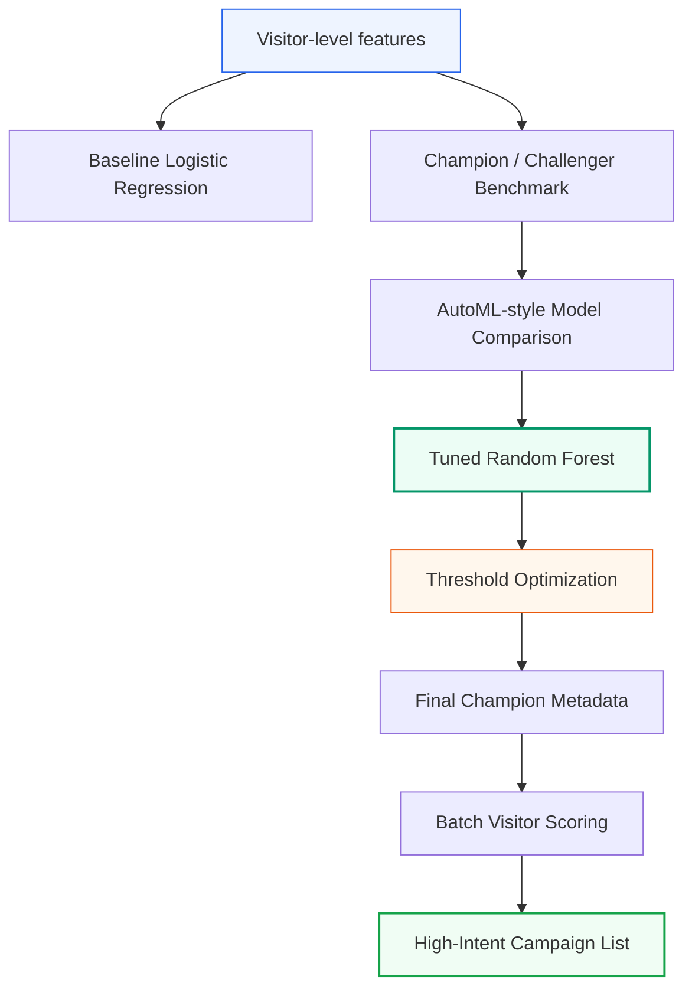
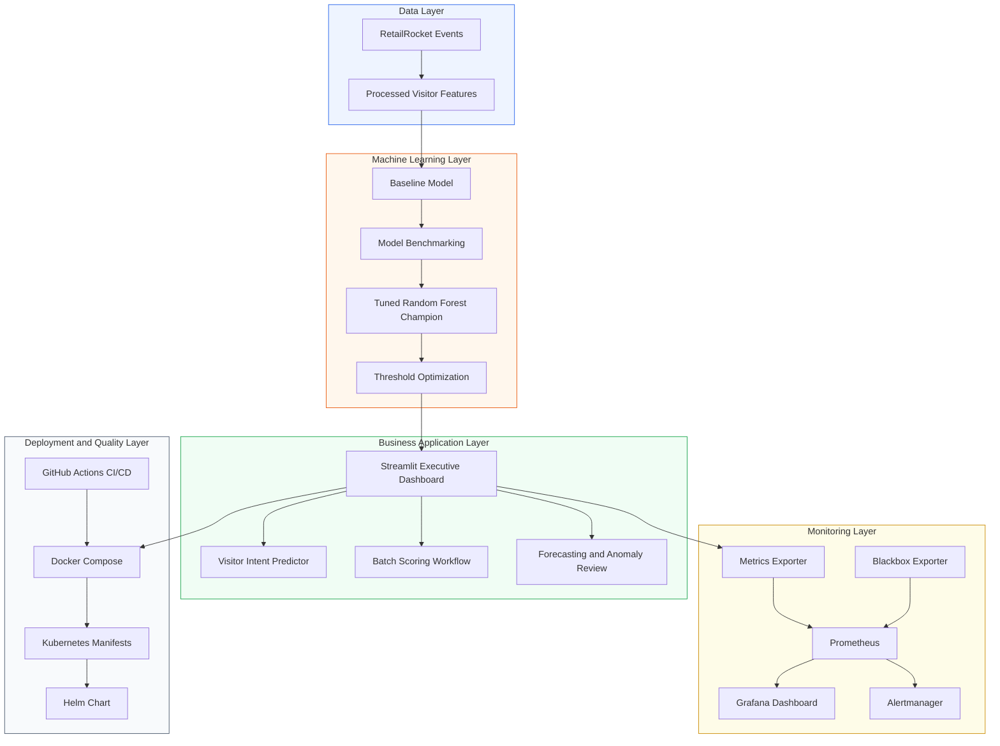
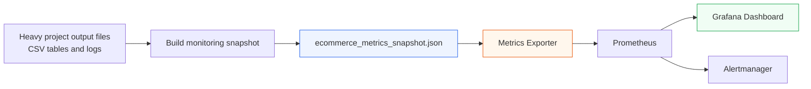
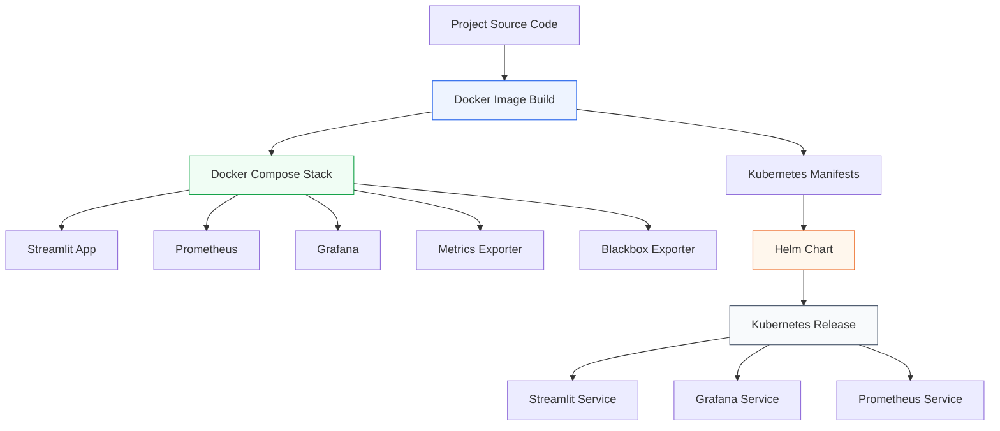

# E-Commerce Conversion Intelligence Platform

### Machine Learning + MLOps platform for predicting purchase intent, ranking high-value visitors, and turning raw e-commerce behaviour into campaign-ready business decisions.

<br>


<br><br>

<table>
<tr>
<td align="center"><b>1.4M+</b><br>Visitors analyzed</td>
<td align="center"><b>19.6K</b><br>High-intent visitors</td>
<td align="center"><b>0.4151</b><br>PR-AUC</td>
<td align="center"><b>0.9696</b><br>ROC-AUC</td>
<td align="center"><b>36.61%</b><br>Precision</td>
<td align="center"><b>72.16%</b><br>Recall</td>
</tr>
</table>

<br>

**From raw RetailRocket visitor events → visitor-level features → purchase-intent scores → campaign audience → Streamlit business app → monitored MLOps deployment.**

</div>

---

## Table of Contents

* [Project Summary](#project-summary)
* [Business Problem](#business-problem)
* [Key Results](#key-results)
* [Original Dataset Background](#original-dataset-background)
* [Data Flow](#data-flow-from-raw-events-to-campaign-audience)
* [Feature Engineering](#feature-engineering)
* [Machine Learning Strategy](#machine-learning-strategy)
* [Final Champion Model](#final-champion-model)
* [Streamlit Business Application](#streamlit-business-application)
* [Platform Architecture](#platform-architecture)
* [Monitoring and MLOps Design](#monitoring-and-mlops-design)
* [Deployment](#deployment)
* [CI/CD Quality Gates](#cicd-quality-gates)
* [Recommended Run Order](#recommended-run-order)
* [Project Structure](#project-structure)
* [Portfolio and Recruiter Value](#portfolio-and-recruiter-value)
* [Limitations](#limitations)
* [Future Improvements](#future-improvements)

---

## Project Summary

The **E-Commerce Conversion Intelligence Platform** is an end-to-end machine learning and MLOps project built on real e-commerce visitor behaviour data.

The project answers one practical business question:

> Which visitors are most likely to buy, and how should the business act on that information?

The platform takes raw visitor event data, converts it into visitor-level features, trains and selects a purchase-intent model, optimizes a business decision threshold, and produces a high-intent visitor audience for campaign targeting.

This project goes beyond a standard machine learning notebook. It includes a working business application, batch scoring, forecasting, anomaly review, monitoring, alerting design, Docker deployment, Kubernetes and Helm deployment proof, and CI/CD validation.

---

## Business Problem

Most e-commerce visitors do not buy. If a business targets every visitor equally, marketing budget is wasted on many low-intent visitors.

The goal of this project is to help a marketing or growth team identify visitors with stronger buying intent before campaign activation.

Instead of asking:

> How many visitors came to the website?

the platform asks:

> Which visitors show behaviour that suggests they are more likely to buy?

This changes the business workflow from broad targeting to intent-based targeting.

The platform helps the business move from:

| Traditional approach                  | Platform-based approach                          |
| ------------------------------------- | ------------------------------------------------ |
| Target broad visitor groups           | Target high-intent visitors                      |
| Spend budget on many low-intent users | Focus on visitors with stronger purchase signals |
| Use raw traffic counts                | Use visitor-level purchase-intent scores         |
| Manual campaign selection             | Model-supported campaign shortlist               |
| Little production visibility          | Monitoring with Prometheus and Grafana           |

---

## Key Results

| Metric                   |              Result |
| ------------------------ | ------------------: |
| Visitors analyzed        |           1,407,500 |
| High-intent visitors     |              19,588 |
| Observed conversion rate |              0.827% |
| Final champion model     | Tuned Random Forest |
| PR-AUC                   |              0.4151 |
| ROC-AUC                  |              0.9696 |
| Precision                |              36.61% |
| Recall                   |              72.16% |
| F1 Score                 |              0.4858 |
| Decision threshold       |                0.97 |
| Anomaly rate             |               3.66% |

### Business meaning

The original visitor population is large, but only a small share of visitors convert. Random marketing would spend budget on many low-intent visitors.

The model creates a smaller and stronger campaign shortlist:

| Audience             |     Count | Meaning                           |
| -------------------- | --------: | --------------------------------- |
| All visitors         | 1,407,500 | Full visitor population           |
| High-intent visitors |    19,588 | Prioritized campaign audience     |
| High-intent share    |    ~1.39% | Smaller group selected for action |

The model precision of **36.61%** is much higher than the overall observed conversion rate of **0.827%**. This shows that the selected audience has a much stronger buyer concentration than the full visitor base.

This should be treated as model-evaluation evidence. Real campaign uplift should still be validated with A/B testing before production business claims.

---

## Original Dataset Background

This project uses the **RetailRocket e-commerce dataset** from Kaggle:

[RetailRocket E-Commerce Dataset](https://www.kaggle.com/datasets/retailrocket/ecommerce-dataset)

The original dataset is based on visitor behaviour from an e-commerce website. It contains event-level records, meaning one row represents one visitor action.

Examples of events:

* a visitor views an item
* a visitor adds an item to cart
* a visitor completes a transaction

The original dataset is useful because it reflects realistic e-commerce behaviour. Most visitors only browse, fewer visitors add products to cart, and only a very small share complete a transaction.

### Original dataset files

| File                  | Description                                                                  | Project relevance                                     |
| --------------------- | ---------------------------------------------------------------------------- | ----------------------------------------------------- |
| `events.csv`          | Visitor behaviour events such as views, add-to-cart actions and transactions | Main source for purchase-intent modelling             |
| `item_properties.csv` | Item-level property information over time                                    | Useful for product context and recommender-style work |
| `category_tree.csv`   | Product category hierarchy                                                   | Useful for product/category relationship analysis     |

### Original data grain

The original dataset is not directly a campaign targeting table.

One visitor can appear many times because each row is one event. A marketing team does not usually target individual clicks. It targets visitors.

Therefore, the project transforms the data from:

> one row per event

into:

> one row per visitor

This transformation is important because the final business decision is visitor-level: which visitors should be prioritized for campaign activation?

---

## Data Flow: From Raw Events to Campaign Audience

```mermaid
flowchart LR
    A[RetailRocket events.csv<br/>One row = one visitor action] --> B[Clean and prepare events]
    B --> C[Aggregate behaviour by visitor]
    C --> D[Visitor-level feature table]
    D --> E[Purchase-intent model]
    E --> F[Intent score per visitor]
    F --> G[Threshold optimization]
    G --> H[High-intent campaign audience]

    style A fill:#eef4ff,stroke:#2563eb,stroke-width:1px
    style D fill:#f0fdf4,stroke:#16a34a,stroke-width:1px
    style E fill:#fff7ed,stroke:#ea580c,stroke-width:1px
    style H fill:#ecfdf5,stroke:#059669,stroke-width:2px
```



### Why this flow matters

The raw data shows actions. The business needs decisions.

The data flow converts millions of behaviour events into a visitor-level table. This makes the machine learning model useful for marketing because every visitor can receive a score and a recommended action.

---

## Feature Engineering

The model learns from visitor behaviour patterns.

The raw events are converted into visitor-level features such as:

| Feature            | Meaning                                               |
| ------------------ | ----------------------------------------------------- |
| `view_count`       | How often the visitor viewed products                 |
| `addtocart_count`  | How often the visitor added products to cart          |
| `unique_items`     | How many different items the visitor interacted with  |
| `activity_span_ms` | How long the visitor activity lasted                  |
| `converted`        | Target variable showing whether the visitor purchased |

These features help the model understand different levels of purchase intent.

For example, a visitor who viewed many products and added items to cart usually shows stronger buying intent than a visitor with only one product view.

---

## Machine Learning Strategy

The project is a rare-conversion problem because the observed conversion rate is only **0.827%**.

In this type of problem, accuracy alone can be misleading. A model can look accurate by predicting that most visitors will not buy, but that does not help marketing teams find buyers.

Therefore, the project focuses on metrics that are more useful for rare purchase prediction:

| Metric    | Why it matters                                                            |
| --------- | ------------------------------------------------------------------------- |
| PR-AUC    | Measures how well the model ranks likely buyers when conversions are rare |
| ROC-AUC   | Measures overall separation between buyers and non-buyers                 |
| Precision | Shows how clean the selected campaign audience is                         |
| Recall    | Shows how many actual buyers the model captures                           |
| F1 Score  | Balances precision and recall                                             |
| Threshold | Controls how many visitors enter the campaign shortlist                   |

---

## Model Workflow



---

## Final Champion Model

The final deployable champion model is:

> **Tuned Random Forest**

It was selected because it performed strongly for purchase-intent ranking and business targeting.

| Metric    | Result | Simple meaning                                             |
| --------- | -----: | ---------------------------------------------------------- |
| PR-AUC    | 0.4151 | Strong buyer-ranking quality for a rare-conversion problem |
| ROC-AUC   | 0.9696 | Strong separation between likely buyers and non-buyers     |
| Precision | 36.61% | Higher-quality selected audience                           |
| Recall    | 72.16% | Captures a large share of buyers                           |
| F1 Score  | 0.4858 | Balanced precision and recall                              |
| Threshold |   0.97 | Final campaign decision cutoff                             |

The model does not only return a score. It supports a business action: decide which visitors should be prioritized.

---

## Threshold Optimization

The decision threshold is important because it controls the size and quality of the campaign audience.

A lower threshold selects more visitors. This may capture more buyers, but it can also include more low-intent visitors.

A higher threshold selects fewer visitors. This creates a smaller campaign audience, but the audience is usually cleaner and more focused.

The final threshold of **0.97** was selected to create a focused high-intent visitor group for business targeting.

---

## Streamlit Business Application

The project includes a Streamlit application for business users.

Run the app with:

```bash
python3 -m streamlit run app/Executive_Overview.py
```

Main app pages:

| Page                      | Purpose                                             |
| ------------------------- | --------------------------------------------------- |
| Executive Overview        | Shows the full business story and headline KPIs     |
| Visitor Intent Predictor  | Scores a single visitor scenario                    |
| Batch Scoring             | Scores many visitors for campaign activation        |
| Model Benchmark Selection | Explains model comparison and final champion choice |
| Business KPI Forecasting  | Forecasts future business and operational KPIs      |
| Anomaly Outlier Detection | Reviews unusual visitor behaviour                   |
| Monitoring Drift Health   | Shows system health and model monitoring views      |
| MLOps Architecture        | Explains the production-style platform design       |
| MVD Coverage Proof        | Shows course/project method coverage evidence       |

---

## Platform Architecture



### Architecture meaning

The platform is designed as a complete analytics-to-deployment workflow.

The data layer prepares visitor behaviour data. The machine learning layer trains and selects the purchase-intent model. The business layer makes the model usable through Streamlit. The monitoring layer checks system health and model-related metrics. The deployment layer shows how the project can run with Docker, Kubernetes, Helm, and CI/CD validation.

---

## Monitoring and MLOps Design

The monitoring layer is designed to show whether the system is running correctly after deployment.

The project includes:

| Component         | Purpose                                         |
| ----------------- | ----------------------------------------------- |
| Metrics Exporter  | Exposes project metrics for Prometheus          |
| Prometheus        | Scrapes metrics and service health              |
| Grafana           | Displays mission-control dashboards             |
| Blackbox Exporter | Checks Streamlit app health endpoint            |
| Alertmanager      | Supports alerting rules and notification design |

### Fast monitoring snapshot design

The project uses a cached monitoring snapshot so Prometheus does not repeatedly scan large CSV files.



This design is useful because monitoring tools should be fast and stable. Prometheus should read lightweight metrics, not repeatedly process heavy analytical files.

---

## Deployment

The project supports both local and Kubernetes-style deployment.



Docker Compose proves that the project can run as a local multi-service stack.

Kubernetes and Helm show how the same project can be packaged for an orchestration environment.

---

## Docker Compose Run

Run from the project root:

```bash
python3 -m src.monitoring.build_monitoring_snapshot
docker compose up -d --build
docker compose ps
```

Open the services:

| Service    | Local URL             |
| ---------- | --------------------- |
| Streamlit  | http://localhost:8501 |
| Grafana    | http://localhost:3000 |
| Prometheus | http://localhost:9090 |

Do not store production secrets directly in public documentation. For production-style use, credentials should be handled through environment variables, `.env` files, or Kubernetes Secrets.

---

## Kubernetes and Helm Run

```bash
export PATH="$HOME/.local/bin:$PATH"

helm upgrade --install ecommerce-conversion-platform helm/ecommerce-conversion-platform \
  --namespace ecommerce-mlops \
  --create-namespace

kubectl get pods -n ecommerce-mlops
kubectl get svc -n ecommerce-mlops
helm list -n ecommerce-mlops
```

Port-forward demo services:

```bash
kubectl port-forward -n ecommerce-mlops svc/streamlit-service 8502:8501
kubectl port-forward -n ecommerce-mlops svc/grafana-service 3001:3000
kubectl port-forward -n ecommerce-mlops svc/prometheus-service 9091:9090
```

Open:

| Service    | Local URL             |
| ---------- | --------------------- |
| Streamlit  | http://localhost:8502 |
| Grafana    | http://localhost:3001 |
| Prometheus | http://localhost:9091 |

Quick Kubernetes demo:

```bash
./scripts/k8s_demo_start.sh
```

Stop port-forwards:

```bash
./scripts/k8s_demo_stop.sh
```

---

## CI/CD Quality Gates

The project includes a GitHub Actions pipeline that validates the project automatically.


### CI/CD checks included

| Quality gate                   | Purpose                                |
| ------------------------------ | -------------------------------------- |
| Python import checks           | Confirms core modules load correctly   |
| Project structure checks       | Confirms important folders exist       |
| Syntax validation              | Confirms Python files compile          |
| pytest                         | Runs automated tests                   |
| Docker build                   | Confirms the app image can be built    |
| Docker Compose validation      | Confirms local stack config is valid   |
| Helm lint                      | Confirms Helm chart structure is valid |
| Kubernetes YAML validation     | Confirms Kubernetes manifest structure |
| Prometheus config validation   | Confirms monitoring config is valid    |
| Alertmanager config validation | Confirms alert config is valid         |
| Grafana JSON validation        | Confirms dashboard JSON is valid       |

---

## Recommended Run Order

Run commands from the project root:

```bash
python3 -m src.data.build_visitor_features
python3 -m src.models.train_baseline_model
python3 -m src.models.analyze_thresholds
python3 -m src.models.run_model_selection
python3 -m src.models.finalize_true_champion
python3 -m src.forecasting.build_business_forecasts
python3 -m src.anomaly.build_anomaly_signals
python3 -m src.models.build_mvd_method_coverage
python3 -m streamlit run app/Executive_Overview.py
```

---

## Project Structure

```text
app/
  Executive_Overview.py
  app_utils.py
  pages/

src/
  data/
  models/
  forecasting/
  anomaly/
  monitoring/

data/
  raw/
  processed/

models/
  trained/
  metadata/

reports/
  tables/
  figures/
  final/

outputs/
  charts/

monitoring/
  prediction_logs/
  prometheus/
  grafana/
  alertmanager/
  metrics_cache/

helm/
  ecommerce-conversion-platform/

k8s/

tests/

.github/
  workflows/
```

---

## Main Outputs

Final champion workflow:

```bash
python3 -m src.models.finalize_true_champion
```

Expected key outputs:

```text
models/trained/final_champion_model.joblib
models/metadata/final_champion_metadata.json
reports/tables/final_true_champion_comparison.csv
reports/tables/final_true_champion_summary.csv
reports/tables/final_true_champion_thresholds.csv
reports/tables/final_true_champion_stability.csv
reports/tables/final_true_champion_sensitivity.csv
data/processed/final_champion_visitor_scores.csv
```

Large raw data and trained binary model files may be excluded from GitHub if they exceed repository size or submission limits. The project includes scripts to regenerate important outputs.

---

## Portfolio and Recruiter Value

This project demonstrates a complete analytics-to-MLOps workflow.

| Skill area         | Evidence in this project                                             |
| ------------------ | -------------------------------------------------------------------- |
| Business analytics | Conversion problem framing, KPI interpretation, campaign targeting   |
| Data engineering   | Event-level to visitor-level transformation                          |
| Machine learning   | Model benchmarking, final champion selection, threshold optimization |
| BI/dashboarding    | Streamlit executive application and business pages                   |
| MLOps              | Monitoring, metrics exporter, Prometheus, Grafana, Alertmanager      |
| Deployment         | Docker Compose, Kubernetes, Helm                                     |
| CI/CD              | GitHub Actions quality gates                                         |
| Communication      | Clear business interpretation and executive project reporting        |

This project is useful for roles such as:

* Data Analyst
* BI Analyst
* Junior Data Scientist
* Analytics Engineer
* ML Engineer
* MLOps Engineer

---

## Limitations

This project is designed as a strong local and portfolio-grade MLOps project, not a full cloud production system.

Current limitations:

* Deployment is local/demo-oriented, not cloud production.
* Production secrets should be managed with Kubernetes Secrets or a secret manager.
* Real campaign impact should be validated with A/B testing.
* Monitoring snapshot refresh should be scheduled in production.
* Model drift should be monitored continuously over time.
* Retraining should be automated before real production use.

---

## Future Improvements

Planned improvements:

* Add scheduled model retraining.
* Add a model registry promotion workflow.
* Deploy to a cloud environment.
* Add real-time event streaming.
* Add campaign uplift measurement.
* Add Kubernetes CronJob for monitoring snapshot refresh.
* Add stronger drift detection and automated alerts.
* Add role-based access for dashboard users.

---

## Final Message

This project shows the full path from raw e-commerce behaviour to business-ready machine learning:

```text
raw visitor events
        ↓
visitor-level features
        ↓
purchase-intent model
        ↓
high-intent campaign audience
        ↓
Streamlit business app
        ↓
Prometheus + Grafana monitoring
        ↓
Docker + Kubernetes + Helm deployment path
        ↓
CI/CD validated project
```

The strongest value of the project is that it connects machine learning output to a real business decision: identifying which visitors should be prioritized for marketing action.
