<div align="center">

# E-Commerce Conversion Intelligence Platform

### End-to-end machine learning, business intelligence, and MLOps for purchase-intent prediction

Transforming raw e-commerce behaviour into visitor-level intelligence, campaign-ready audiences, explainable model decisions, monitored production signals, and deployable business applications.

[](https://ecommerce-conversion-intelligence.streamlit.app)
[](https://github.com/RuturajM31/E-Commerce-Conversion-Intelligence-Platform/actions/workflows/ci.yml)
[](https://www.python.org/)
[](LICENSE)
[](https://github.com/RuturajM31/E-Commerce-Conversion-Intelligence-Platform/commits/main)
[](https://github.com/RuturajM31/E-Commerce-Conversion-Intelligence-Platform/stargazers)

[](https://streamlit.io/)
[](https://scikit-learn.org/)
[](https://xgboost.ai/)
[](https://mlflow.org/)
[](https://www.evidentlyai.com/)
[](https://plotly.com/python/)

[](https://www.docker.com/)
[](https://kubernetes.io/)
[](https://helm.sh/)
[](https://prometheus.io/)
[](https://grafana.com/)
[](https://pytest.org/)
[](https://docs.astral.sh/ruff/)
[](https://pypi.org/project/pip-audit/)

<br/>

[**Launch the app**](https://ecommerce-conversion-intelligence.streamlit.app)
·
[**View CI/CD**](https://github.com/RuturajM31/E-Commerce-Conversion-Intelligence-Platform/actions/workflows/ci.yml)
·
[**Explore the source**](https://github.com/RuturajM31/E-Commerce-Conversion-Intelligence-Platform)

</div>

---

## Executive Summary

The **E-Commerce Conversion Intelligence Platform** is a portfolio-grade, end-to-end machine learning and MLOps system built to answer one practical business question:

> **Which visitors are most likely to purchase, and how should the business act on that signal?**

The platform converts raw RetailRocket event data into visitor-level features, benchmarks multiple models, selects and validates a champion, optimizes the decision threshold, scores visitors, creates campaign-ready audiences, explains model decisions, monitors drift and delayed outcomes, and presents the complete workflow through a multi-page Streamlit business application.

This is not only a predictive model. It is a complete analytics product that connects:

- business problem framing;
- event-level data engineering;
- rare-event classification;
- campaign prioritization;
- model explainability;
- experiment tracking;
- drift monitoring;
- delayed-label performance measurement;
- business forecasting;
- anomaly detection;
- customer segmentation and journey intelligence;
- containerization and orchestration;
- CI/CD, security, and reproducibility controls.

---

## Project at a Glance

| Metric | Result | Business meaning |
|---|---:|---|
| Visitors analyzed | **1,407,500** | Full visitor population evaluated |
| Observed conversion rate | **0.827%** | Highly imbalanced purchase problem |
| High-intent audience | **19,588 visitors** | Focused campaign activation group |
| High-intent share | **~1.39%** | Small, prioritized audience |
| Champion model | **Tuned Random Forest** | Final deployable purchase-intent model |
| PR-AUC | **0.4151** | Strong ranking quality for rare conversions |
| ROC-AUC | **0.9696** | Strong class separation |
| Precision | **36.61%** | Selected audience is much cleaner than random targeting |
| Recall | **72.16%** | Captures a large share of actual buyers |
| F1 score | **0.4858** | Balanced precision and recall |
| Decision threshold | **0.97** | Business cutoff for high-intent selection |
| Anomaly rate | **3.66%** | Share of visitors flagged for unusual behaviour |
| Buyer concentration | **~44× baseline** | Model precision versus observed conversion rate |

> **Important:** the ~44× concentration is model-evaluation evidence, not proven campaign uplift. Real marketing impact must still be validated with controlled A/B testing.

---

## Why This Project Matters

Most e-commerce visitors do not purchase. Broad targeting wastes budget on users with little evidence of intent.

This platform changes the decision process from:

| Traditional workflow | Intelligence-driven workflow |
|---|---|
| Target a broad visitor population | Prioritize high-intent visitors |
| Use traffic volume as the main signal | Use visitor-level purchase probability |
| Select campaigns manually | Use model-supported audience ranking |
| Monitor only application uptime | Monitor features, predictions, outcomes, and services |
| Treat ML as a notebook result | Deliver ML through a governed business application |

The final output is not simply a probability. It is a decision system:

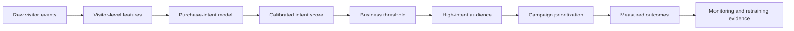

---

## Business Capabilities

The platform supports six connected decision areas:

| Capability | Business output |
|---|---|
| Purchase-intent prediction | Probability that a visitor will convert |
| Campaign prioritization | Ranked and capacity-aware high-intent audience |
| Model governance | Champion/challenger comparison, threshold, stability, and economics |
| Customer intelligence | Segments, nearest-neighbour context, and journey patterns |
| Operational intelligence | Forecasts, anomalies, drift, delayed outcomes, and system health |
| Deployment intelligence | Streamlit Cloud, Docker Compose, Kubernetes, Helm, and CI/CD evidence |

---

## End-to-End Platform Architecture

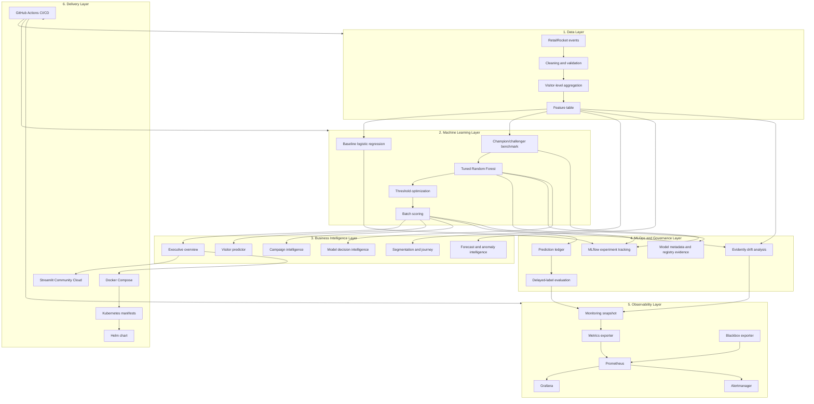

---

## Data Engineering Pipeline

The RetailRocket dataset is event-level: one row represents one visitor action such as a product view, add-to-cart event, or transaction. The business decision is visitor-level, so the project changes the data grain.

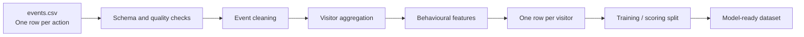

### Core visitor features

| Feature | Meaning |
|---|---|
| `view_count` | Number of product views |
| `addtocart_count` | Number of add-to-cart actions |
| `unique_items` | Number of distinct items viewed |
| `activity_span_ms` | Duration of observed visitor activity |
| `converted` | Purchase outcome used as the target |

The project also contains modular packages for:

- feature engineering;
- segmentation;
- forecasting;
- anomaly detection;
- model evaluation;
- monitoring and delayed labels;
- visualization and business intelligence.

---

## Machine Learning Strategy

The observed conversion rate is only **0.827%**, so accuracy is not a useful primary metric. A model that predicts “no purchase” for almost everyone can look accurate while being useless for campaign targeting.

The project therefore emphasizes:

| Metric | Why it matters |
|---|---|
| PR-AUC | Evaluates ranking quality under severe class imbalance |
| ROC-AUC | Measures buyer versus non-buyer separation |
| Precision | Measures the quality of the selected campaign audience |
| Recall | Measures how many actual buyers are captured |
| F1 | Balances precision and recall |
| Threshold economics | Converts model scores into a business operating decision |

### Model lifecycle

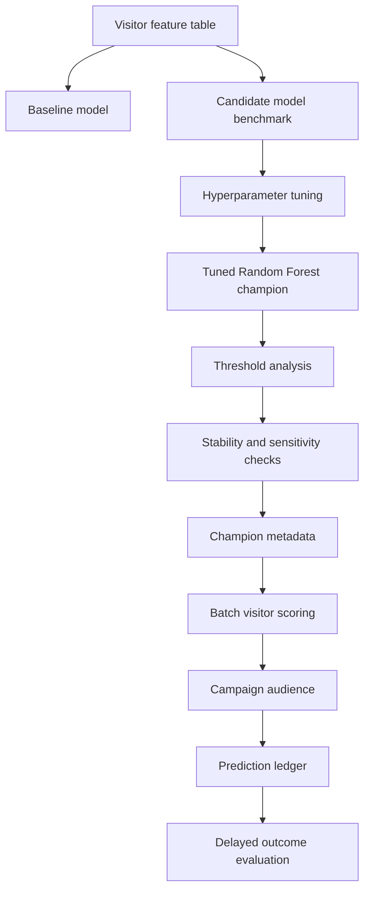

### Champion decision

The tuned Random Forest was selected because it combined strong rare-event ranking with a practical campaign operating point:

- **PR-AUC:** 0.4151
- **ROC-AUC:** 0.9696
- **Precision:** 36.61%
- **Recall:** 72.16%
- **F1:** 0.4858
- **Decision threshold:** 0.97

---

## Streamlit Business Application

The Streamlit application is the business-facing layer of the platform.

**Entrypoint:** `app/Executive_Overview.py`

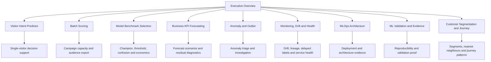

### Application pages

| Page | Primary purpose |
|---|---|
| Executive Overview | Headline KPIs, business narrative, risk, and action priorities |
| Visitor Intent Predictor | Score and explain a single visitor scenario |
| Batch Scoring | Score visitors, apply campaign capacity, and create target audiences |
| Model Benchmark Selection | Compare candidates and explain the champion decision |
| Business KPI Forecasting | Forecast business KPIs with scenario and residual diagnostics |
| Anomaly and Outlier | Detect, rank, and investigate unusual behaviour |
| Monitoring, Drift and Health | Review data drift, prediction drift, delayed outcomes, and service status |
| MLOps Architecture | Explain platform components, deployment paths, and operational boundaries |
| ML Validation and Evidence | Surface test, reproducibility, provenance, and model-validation evidence |
| Customer Segmentation and Journey | Explore behavioural segments, similar visitors, and journey patterns |

---

## Campaign Intelligence

Batch scoring is designed as a business workflow, not only a technical inference step.


The app supports:

- score distributions;
- campaign capacity scenarios;
- audience-size trade-offs;
- threshold effects;
- high-intent segment composition;
- conversion-risk context;
- action recommendations;
- exportable campaign lists.

---

## Explainability and Similarity Intelligence

The platform combines global model evidence with local visitor-level context.

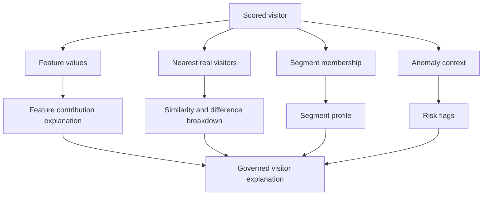

This supports more responsible business use by showing:

- why a visitor received a score;
- which behaviours are most influential;
- how the visitor compares with similar real visitors;
- whether the visitor belongs to a specific behavioural segment;
- whether anomaly signals require additional review.

---

## MLflow Experiment Tracking Architecture

MLflow is isolated from the lightweight app runtime and uses its own pinned environment.

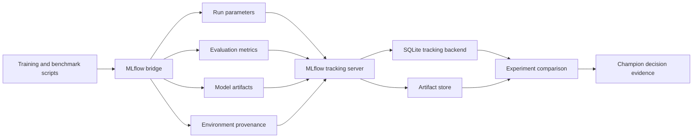

### MLflow responsibilities

- record model parameters and evaluation metrics;
- preserve experiment and environment provenance;
- validate model serialization and loading;
- support champion/challenger evidence;
- provide an auditable bridge between training and deployment metadata.

**Isolated dependency file:** `requirements-mlflow.txt`

**Validated MLflow version:** `3.14.0`

---

## Evidently Drift and Monitoring Architecture

Evidently is used in an isolated monitoring environment to avoid dependency conflicts with the application runtime.

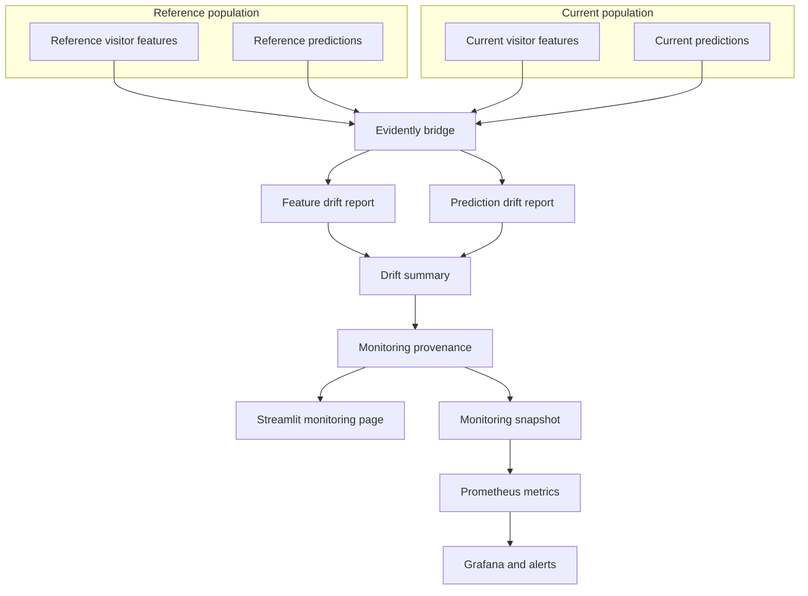

### Evidently responsibilities

- compare reference and current feature distributions;
- evaluate prediction drift;
- summarize drifted features and affected populations;
- preserve report provenance;
- feed drift evidence into the monitoring layer and Streamlit application.

**Isolated dependency file:** `requirements-evidently.txt`

**Validated Evidently version:** `0.7.21`

---

## Delayed Labels and Production Performance

Purchase outcomes may arrive after predictions are made. The project therefore separates prediction-time evidence from later outcome evaluation.

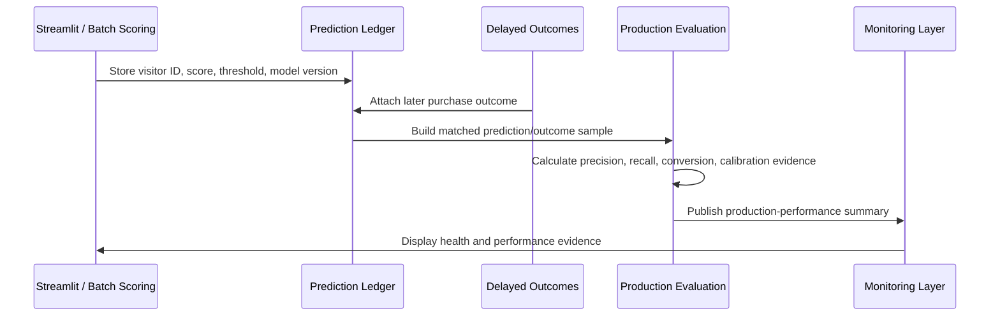

This prevents a common MLOps mistake: evaluating only training metrics while ignoring real post-deployment outcomes.

---

## Monitoring and Observability Stack

The full local monitoring stack includes application, model, and infrastructure signals.

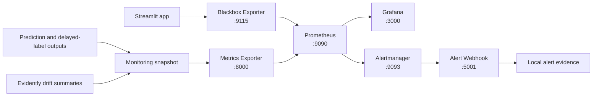

### Monitored areas

| Area | Examples |
|---|---|
| Application health | Streamlit availability and probe status |
| Model output | Score distribution, high-intent rate, threshold outcomes |
| Data quality | Missingness, invalid values, population changes |
| Drift | Feature drift and prediction drift |
| Production outcomes | Delayed-label precision, recall, and conversion evidence |
| Business health | Campaign audience size, forecast movement, anomaly rate |
| Infrastructure | Metrics endpoint health, alert routing, dashboard availability |

### Monitoring snapshot pattern

Prometheus should scrape lightweight metrics, not repeatedly scan large analytical files. The project therefore uses a cached snapshot:

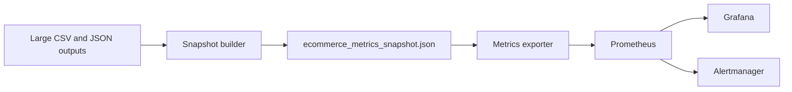

---

## Docker Compose Architecture

The local platform runs as a multi-service Docker Compose stack.

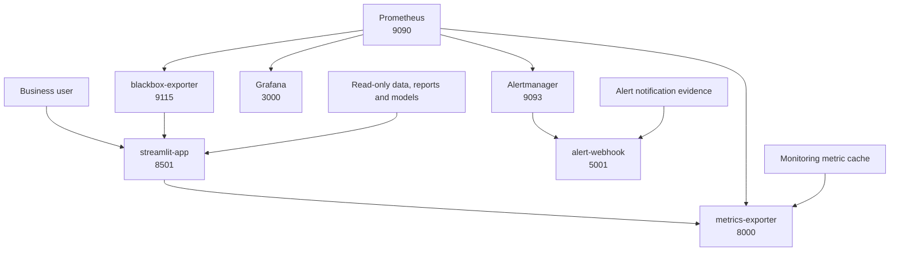

### Docker services

| Service | Purpose | Local port |
|---|---|---:|
| `streamlit-app` | Business application | `8501` |
| `metrics-exporter` | Prometheus-compatible project metrics | `8000` |
| `prometheus` | Metrics collection and rule evaluation | `9090` |
| `blackbox-exporter` | External application health probes | `9115` |
| `alertmanager` | Alert grouping and routing | `9093` |
| `alert-webhook` | Local alert receiver and evidence writer | `5001` |
| `grafana` | Mission-control dashboards | `3000` |

---

## CI/CD and Quality Gates

The GitHub Actions workflow validates code, security, machine learning integrations, containers, orchestration files, and monitoring configuration.

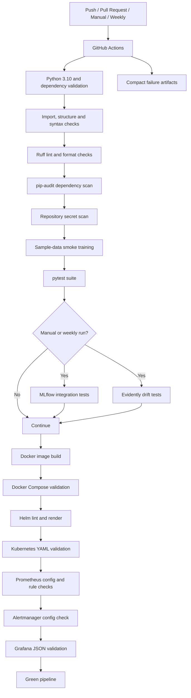

### CI controls

- Python 3.10 dependency installation and `pip check`;
- project import and folder validation;
- Python and shell syntax checks;
- delayed-label and production-performance tests;
- Ruff linting and format checks;
- dependency vulnerability scanning with `pip-audit`;
- repository secret scanning;
- sample-data smoke training;
- complete automated test suite;
- scheduled/manual MLflow integration validation;
- scheduled/manual Evidently integration validation;
- Docker image and Docker Compose validation;
- Helm linting and rendered Kubernetes validation;
- Prometheus, alert-rule, Alertmanager, and Grafana validation;
- compact failure-evidence uploads.

> The CI workflow validates deployment assets but does not automatically deploy production infrastructure.

---

## Deployment Paths

The repository supports three delivery modes.

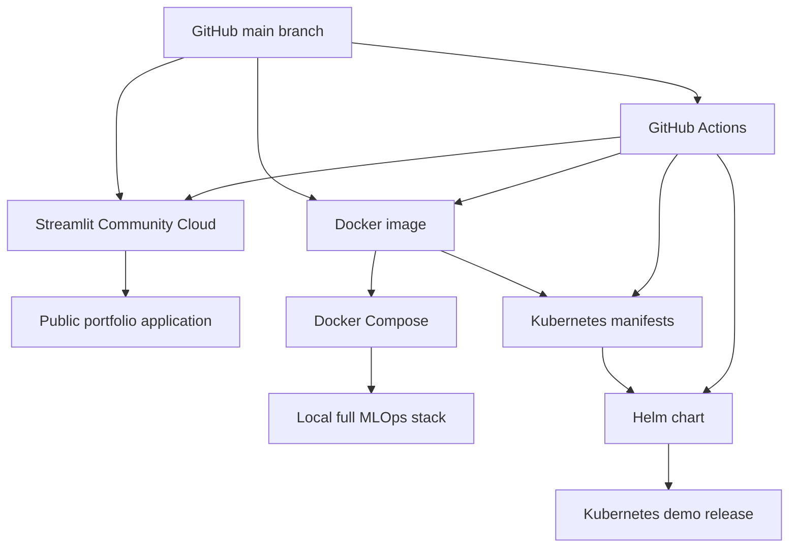

### Streamlit Community Cloud

- **Repository:** `RuturajM31/E-Commerce-Conversion-Intelligence-Platform`
- **Branch:** `main`
- **Entrypoint:** `app/Executive_Overview.py`
- **Validated Python:** `3.10`
- **App dependencies:** `app/requirements.txt`
- **Secrets required:** No
- **Public URL:** `https://ecommerce-conversion-intelligence.streamlit.app`

### Docker Compose

Build the monitoring snapshot before starting the stack:

```bash
python3 -m src.monitoring.build_monitoring_snapshot
docker compose up -d --build
docker compose ps
```

Open:

- Streamlit: `http://localhost:8501`
- Grafana: `http://localhost:3000`
- Prometheus: `http://localhost:9090`

### Kubernetes and Helm demo

```bash
helm upgrade --install ecommerce-conversion-platform \
  helm/ecommerce-conversion-platform \
  --namespace ecommerce-mlops \
  --create-namespace
```

The secure wrapper manages the local Kubernetes demo and generates a local Grafana password:

```bash
./E-Commerce-Conversion-Intelligence-Platform start
./E-Commerce-Conversion-Intelligence-Platform password
./E-Commerce-Conversion-Intelligence-Platform stop
```

---

## Quick Start

### 1. Clone the repository

```bash
git clone https://github.com/RuturajM31/E-Commerce-Conversion-Intelligence-Platform.git
cd E-Commerce-Conversion-Intelligence-Platform
```

### 2. Create a Python 3.10 environment

```bash
python3.10 -m venv .venv
source .venv/bin/activate
python -m pip install --upgrade pip
```

### 3. Install the project

```bash
python -m pip install -r requirements.txt
```

### 4. Launch Streamlit

```bash
python -m streamlit run app/Executive_Overview.py
```

### 5. Run tests

```bash
python -m pytest -q
```

---

## Optional Isolated MLOps Environments

The main application remains lightweight. MLflow and Evidently are intentionally isolated.

### MLflow validation environment

```bash
python3.10 -m venv .venv-mlflow
source .venv-mlflow/bin/activate
python -m pip install -r requirements-mlflow.txt
python -m pytest tests/test_mlflow_bridge.py -q
```

### Evidently validation environment

```bash
python3.10 -m venv .venv-evidently
source .venv-evidently/bin/activate
python -m pip install -r requirements-evidently.txt
python -m pytest \
  tests/test_evidently_bridge.py \
  tests/test_drift_summary.py \
  -q
```

---

## Reproducibility and Security

The project uses explicit controls to make results repeatable and repository operations safer.

### Dependency strategy

| File | Purpose |
|---|---|
| `requirements.txt` | Full validated project environment |
| `requirements-app.txt` | Lightweight application runtime |
| `app/requirements.txt` | Streamlit Community Cloud runtime |
| `requirements-mlflow.txt` | Isolated MLflow environment |
| `requirements-evidently.txt` | Isolated Evidently environment |
| `requirements-ci.txt` | CI-only quality and security tools |

### Security and reproducibility controls

- exact dependency pinning;
- `pip check` compatibility validation;
- `pip-audit` vulnerability scanning;
- repository secret scanning;
- CI-only disposable fixtures for large local artifacts;
- smoke training from sample data;
- environment provenance recording;
- model serialization and loading tests;
- read-only mounts for data, reports, and models in Docker Compose;
- generated local Grafana password for the Kubernetes demo;
- no committed production credentials.

---

## Repository Structure

```text
E-Commerce-Conversion-Intelligence-Platform/
├── .github/
│   └── workflows/
│       └── ci.yml
├── .streamlit/
│   └── config.toml
├── app/
│   ├── Executive_Overview.py
│   ├── app_utils.py
│   ├── requirements.txt
│   ├── pages/
│   │   ├── 1_Visitor_Intent_Predictor.py
│   │   ├── 2_Batch_Scoring.py
│   │   ├── 3_Model_Benchmark_Selection.py
│   │   ├── 4_Business_KPI_Forecasting.py
│   │   ├── 5_Anomaly_Outlier.py
│   │   ├── 6_Monitoring_Drift_Health.py
│   │   ├── 7_MLOps_Architecture.py
│   │   ├── 8_ML_Validation_Evidence.py
│   │   └── 9_Customer_Segmentation_Journey.py
│   └── ui/
├── src/
│   ├── anomaly/
│   ├── config/
│   ├── data/
│   ├── features/
│   ├── forecasting/
│   ├── models/
│   ├── monitoring/
│   ├── segmentation/
│   └── visualization/
├── data/
│   ├── raw/
│   ├── processed/
│   └── sample/
├── models/
│   ├── trained/
│   └── metadata/
├── reports/
│   ├── figures/
│   ├── final/
│   ├── monitoring/
│   ├── qa/
│   └── tables/
├── monitoring/
│   ├── alertmanager/
│   ├── blackbox/
│   ├── grafana/
│   ├── metrics_cache/
│   ├── prediction_logs/
│   └── prometheus/
├── helm/
│   └── ecommerce-conversion-platform/
├── k8s/
├── scripts/
├── tests/
├── Dockerfile
├── docker-compose.yml
├── Makefile
├── pyproject.toml
└── README.md
```

---

## Key Outputs

| Output | Purpose |
|---|---|
| `models/trained/final_champion_model.joblib` | Serialized champion model |
| `models/metadata/final_champion_metadata.json` | Model identity, threshold, metrics, and provenance |
| `data/processed/final_champion_visitor_scores.csv` | Visitor-level scores and campaign decisions |
| `reports/tables/final_true_champion_comparison.csv` | Candidate comparison |
| `reports/tables/final_true_champion_thresholds.csv` | Threshold trade-offs |
| `reports/tables/final_true_champion_stability.csv` | Stability evidence |
| `reports/tables/final_true_champion_sensitivity.csv` | Sensitivity evidence |
| `monitoring/metrics_cache/ecommerce_metrics_snapshot.json` | Lightweight Prometheus source |
| `monitoring/prediction_logs/` | Prediction ledger and delayed-label evidence |
| `monitoring/grafana/dashboards/` | Provisioned Grafana dashboards |

Large raw files and trained binary artifacts may be excluded from GitHub. Reproducible scripts and sample-data smoke workflows are included so important outputs can be regenerated and validated.

---

## Visual Intelligence Governance

The final Streamlit enhancement program is controlled by a **204-row visual intelligence matrix**.

| Status | Count |
|---|---:|
| Verified | **177** |
| Conditional | **25** |
| Excluded | **2** |
| Open | **0** |
| Total | **204** |

The matrix covers:

- executive intelligence;
- batch scoring and campaigns;
- model selection and explainability;
- KNN similarity evidence;
- segmentation and journey intelligence;
- forecasting and anomaly investigation;
- monitoring and drift;
- architecture and governance;
- shared UI and UX quality;
- validation and audit evidence.

This provides explicit evidence that the final application was reviewed as a governed product rather than assembled as an untracked collection of charts.

---

## Portfolio Value

This project demonstrates evidence across the complete analytics lifecycle.

| Skill area | Evidence |
|---|---|
| Business analytics | Conversion framing, KPI interpretation, campaign prioritization |
| Data engineering | Event-to-visitor transformation and reproducible feature generation |
| Machine learning | Rare-event modelling, benchmark selection, tuning, threshold economics |
| Explainable AI | Feature contributions, local similarity, segment and anomaly context |
| Customer analytics | Segmentation, journey intelligence, campaign capacity |
| Forecasting | KPI scenarios, uncertainty, residual diagnostics |
| Monitoring | Evidently drift, prediction ledger, delayed labels, service metrics |
| MLOps | MLflow, provenance, model metadata, monitoring snapshots |
| BI and product design | Multi-page Streamlit executive application |
| DevOps | Docker Compose, Kubernetes, Helm, GitHub Actions |
| Security and quality | Ruff, pytest, pip-audit, secret scan, smoke training |
| Technical communication | Architecture diagrams, documented assumptions, decision evidence |

The project is directly relevant to roles such as:

- Data Analyst;
- BI Analyst;
- Product Analyst;
- Marketing Analyst;
- Analytics Engineer;
- Data Scientist;
- Machine Learning Engineer;
- MLOps Engineer.

---

## Honest Limitations

This is a strong portfolio and local production-style platform, but it is not presented as a fully operated enterprise system.

Current boundaries:

- model results are based on a public historical dataset;
- campaign uplift has not yet been validated through a live randomized experiment;
- Streamlit Community Cloud is a portfolio deployment, not a high-availability enterprise serving layer;
- Docker and Kubernetes configurations demonstrate deployment readiness but are not continuously operated cloud infrastructure;
- monitoring snapshots must be scheduled in a real production environment;
- automated retraining and formal model-promotion approval can be expanded;
- access control, audit identity, and centralized secret management would be required for enterprise use.

---

## Roadmap

- [ ] Add campaign A/B testing and uplift measurement
- [ ] Add scheduled retraining and champion promotion
- [ ] Add automated monitoring snapshot refresh
- [ ] Add production feature-store integration
- [ ] Add event streaming for near-real-time scoring
- [ ] Add role-based access control
- [ ] Add managed cloud storage and model registry
- [ ] Add service-level objectives and incident runbooks
- [ ] Add formal data-contract enforcement

---

## Dataset

The project uses the public **RetailRocket E-Commerce Dataset**:

- visitor events;
- item properties;
- category hierarchy.

Dataset source: [RetailRocket recommender system dataset on Kaggle](https://www.kaggle.com/datasets/retailrocket/ecommerce-dataset)

The original event grain is transformed into a visitor-level decision table suitable for purchase-intent modelling and campaign activation.

---

## Author

**Ruturaj Mokashi**

Data Analyst & BI Specialist focused on transforming complex data into clear, measurable business decisions.

[](https://github.com/RuturajM31)
[](https://www.linkedin.com/in/ruturaj-mokashi-09627588)

---

## License

This project is licensed under the [MIT License](LICENSE).

---

<div align="center">

### From raw visitor behaviour to monitored, explainable, campaign-ready intelligence

[Launch App](https://ecommerce-conversion-intelligence.streamlit.app)
·
[View Repository](https://github.com/RuturajM31/E-Commerce-Conversion-Intelligence-Platform)
·
[View CI/CD](https://github.com/RuturajM31/E-Commerce-Conversion-Intelligence-Platform/actions/workflows/ci.yml)

</div>
